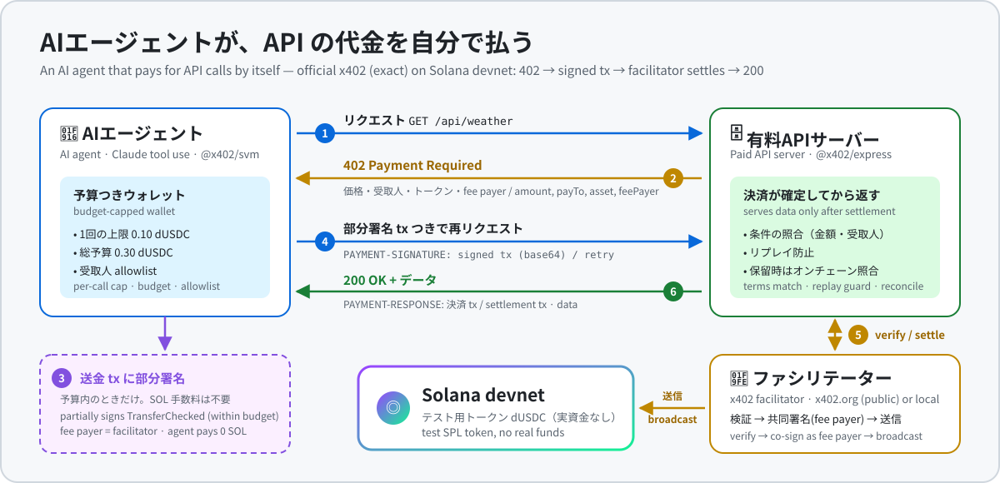
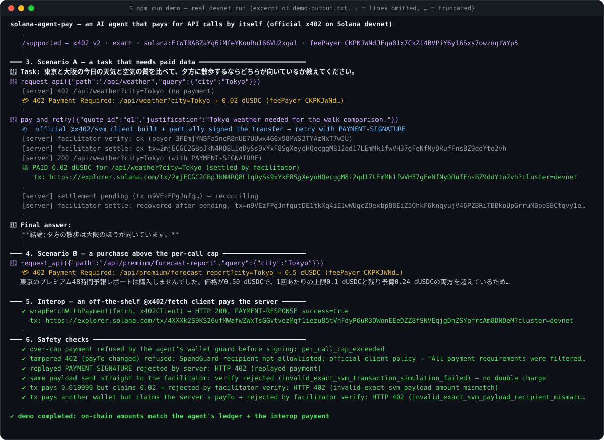
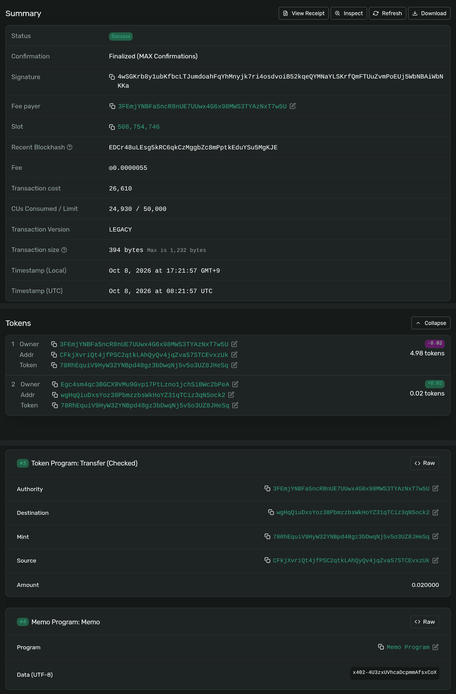
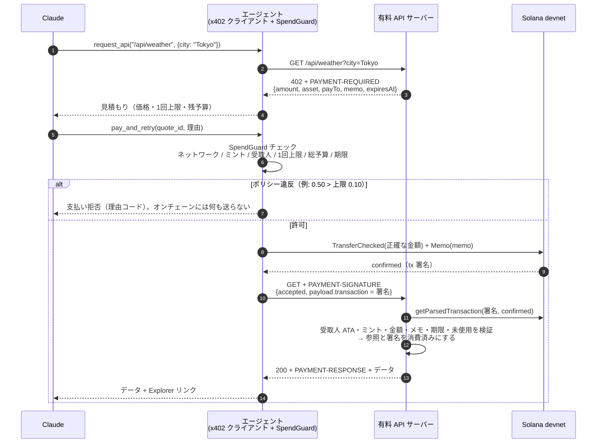
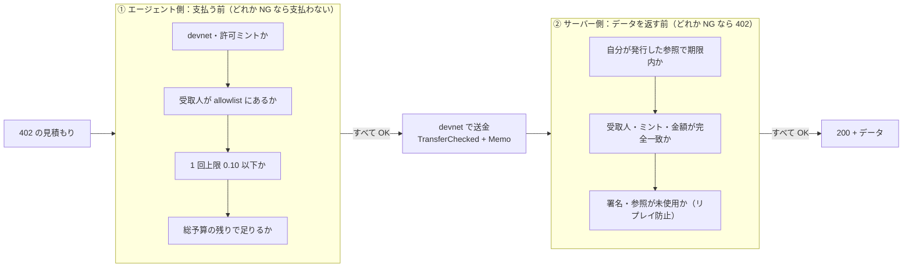

# solana-agent-pay

**AI エージェントが自分で API 利用料を払う** — Solana devnet 上の x402 スタイル決済デモ

<p align="center">
  
</p>

> 画面はなく、ターミナルで動くデモです（有料 API サーバー ＋ AI エージェント）。`npm run demo` 1 コマンドで、エージェントが自分で支払う様子がログとして流れます。

Claude（tool use）で動くエージェントが有料 API を呼び、`HTTP 402 Payment Required` を受け取ると、価格が予算内かを判断して SPL トークンで支払い、トランザクション署名を証明として付けて再リクエストし、タスクを完了します。サーバー側は devnet 上でトランザクションを検証（受取人・金額・ミント・参照メモ・リプレイ・確定状態）してからデータを返します。

> ⚠️ **devnet 専用のデモです。** メインネットや実資金は一切使いません。決済トークン `dUSDC` は**このプロジェクトが devnet 上で独自に発行したテスト用 SPL トークン**（6 decimals）であり、Circle の devnet USDC ではありません。

- 1 コマンドで実行: `npm run demo`
- 実行ログ（実際の devnet トランザクション署名つき）: [`demo-output.txt`](./demo-output.txt)

## デモ結果（devnet, 2026-10-08 実行）

「東京と大阪の天気と空気の質を比べて、夕方の散歩に向いている方は？」というタスクで、エージェントは 4 回の 402 を受け取り、合計 0.06 dUSDC（総予算 0.30）を自分で支払ってデータを購入し、「大阪のほうが向いている」と回答しました。0.50 dUSDC のプレミアムレポート（1 回上限 0.10 超え）は購入を見送り、安全チェック（上限超過の拒否・改ざん 402 の拒否・署名リプレイの拒否）もすべて期待どおりでした。サーバーの受取残高の増加（0 → 0.06）はエージェントの支払い台帳と一致しています。

<p align="center">
  
  <br><sub>実際の devnet 実行ログ <a href="./demo-output.txt"><code>demo-output.txt</code></a> の抜粋（⋮ は省略行、… は行末の省略）。<a href="docs/images/demo-terminal-animated.svg">アニメーション版</a></sub>
</p>

| 支払い | 金額 | devnet トランザクション |
|---|---|---|
| `/api/weather?city=Tokyo` | 0.02 dUSDC | [4wSGKrb8…bNKKa](https://explorer.solana.com/tx/4wSGKrb8y1ubKfbcLTJumdoahFqYhMnyjk7ri4osdvoiB52kqeQYMNaYLSKrfQmFTUuZvmPoEUj5WbNBAiWbNKKa?cluster=devnet) |
| `/api/weather?city=Osaka` | 0.02 dUSDC | [4KcoNQXs…RHVHwF](https://explorer.solana.com/tx/4KcoNQXsZpRwqKnwDpaUYZ1ZQ1ka9rJaN8oypT2msorbt36V5ZSYiaztnk64qN2gizcvQJriUWNDRG5yCRrHVHwF?cluster=devnet) |
| `/api/air-quality?city=Tokyo` | 0.01 dUSDC | [Wi6rRvEp…2ruXs](https://explorer.solana.com/tx/Wi6rRvEpgNq7DLySd46Up86AbrXpaLW4DdvtXC54hhNNhaNuZrK9ifdW7fQvHLRbLvWXQBPpKcWmHNETGB2ruXs?cluster=devnet) |

各トランザクションには SPL Token `TransferChecked`（受取人 ATA へ正確な金額）と、サーバーが発行したワンタイム参照の SPL Memo（例: `x402-4U3zxUVhcaDcpmmAfsxCoX`）が含まれます。テストトークンのミント: [78RhEqui…MqvWEcW6](https://explorer.solana.com/address/78RhEquiV9HyW32YNBpd48gz3bDwqNj5v5o3UZ8JHeSq?cluster=devnet)

<details>
<summary>📸 Solana Explorer で見た 1 件目の支払い（Tokyo weather, 0.02 dUSDC）</summary>
<br>
<p align="center">
  <a href="https://explorer.solana.com/tx/4wSGKrb8y1ubKfbcLTJumdoahFqYhMnyjk7ri4osdvoiB52kqeQYMNaYLSKrfQmFTUuZvmPoEUj5WbNBAiWbNKKa?cluster=devnet">
    
  </a>
  <br><sub>Status: Success（Finalized）、トークン残高の増減（エージェント −0.02 / サーバー +0.02）、<code>Transfer (Checked)</code> 命令、サーバー発行の参照メモ <code>x402-4U3zxUVhcaDcpmmAfsxCoX</code>。2026-10-08 にヘッドレス Chrome で取得したスクリーンショットを切り抜いたもの。</sub>
</p>
</details>

## 何ができるか

| | |
|---|---|
| 💳 **有料 API サーバー** | 未払いリクエストに `402` と支払い条件（受取人・金額・ミント・ネットワーク・ワンタイム参照・有効期限）を返す。支払い後は devnet でトランザクションを検証してからデータを返す |
| 🤖 **AI エージェント** | Claude が価格と残予算を見て「払う価値があるか」を判断。支払い → 証明付きリトライ → タスク完了。全支払いを Solana Explorer リンクつきで記録 |
| 🛡️ **安全装置** | 1 回あたり上限・総予算上限・受取人 allowlist・ミント/ネットワーク制限（コード側で強制。LLM は上書き不可）、サーバー側のリプレイ防止 |
| 🧪 **テスト** | 検証ロジックのユニットテスト（正常・金額違い・受取人違い・リプレイほか）、HTTP レベルのテスト、devnet 実トランザクションでの統合テスト |

## アーキテクチャ

```mermaid
flowchart LR
    U([ユーザーのタスク]) --> A
    subgraph Agent["AI エージェント (Node.js)"]
        A["Claude<br/>tool use"] -->|request_api / pay_and_retry| X["x402 クライアント"]
        X --> G{"SpendGuard<br/>上限・予算・allowlist"}
        G -->|許可| W["Agent Wallet<br/>(devnet keypair)"]
        G -->|拒否| A
    end
    X -- "GET (未払い)" --> S
    S -- "402 + PAYMENT-REQUIRED" --> X
    W -- "TransferChecked + Memo(参照)" --> SOL[("Solana devnet")]
    X -- "GET + PAYMENT-SIGNATURE (tx 署名)" --> S
    subgraph Server["有料 API サーバー"]
        S["HTTP サーバー"] --> V["検証<br/>verifyPayment"]
        V --> ST[("Quote / 使用済み署名ストア")]
    end
    V -- "getParsedTransaction (confirmed)" --> SOL
    S -- "200 + PAYMENT-RESPONSE" --> X
    S --> D["データ提供元<br/>(Open-Meteo)"]
```



### 決済フロー（有料 API 1 回分）



### 安全チェックの全体像



| チェック | どこで | 守るもの | デモでの確認 |
|---|---|---|---|
| 1 回あたり上限（0.10 dUSDC） | エージェント（`SpendGuard`） | 高額な請求 | 0.50 のプレミアムレポートを拒否 `per_call_cap_exceeded` |
| 総予算（0.30 dUSDC） | エージェント | 使いすぎ | 支払い中の分も予約として計上 |
| 受取人 allowlist | エージェント | 改ざんされた 402 | `payTo` 差し替えを拒否 `recipient_not_allowlisted` |
| devnet・許可ミントのみ | エージェント / サーバー | 誤ネットワーク・偽トークン | メインネット指定はテストで拒否 |
| リプレイ防止（署名・参照は 1 回限り） | サーバー | 同じ支払いの使い回し | 使用済み署名の再送を拒否 `replayed_signature` |
| 金額・受取人・ミント・メモの完全一致 | サーバー | 不足払い・別宛て送金 | ユニット / devnet テストで確認 |

## x402 との対応関係

[x402 v2 仕様](https://github.com/x402-foundation/x402)のワイヤーフォーマットに揃えています。

| 項目 | このデモ | x402 v2 |
|---|---|---|
| 402 シグナル | `PAYMENT-REQUIRED` ヘッダ（base64 JSON）+ 同内容の JSON ボディ | 同じ |
| `PaymentRequired` / `accepts[]` | `x402Version: 2`, `scheme: "exact"`, `network`（CAIP-2: `solana:EtWTRABZaYq6iMfeYKouRu166VU2xqa1` = devnet）, `amount`（最小単位）, `asset`（ミント）, `payTo`, `maxTimeoutSeconds`, `extra` | 同じ |
| 参照 | `extra.memo`（ワンタイム、SPL Memo 命令に入れる） | Solana `exact` の `extra.memo` と同じ考え方 |
| 支払い証明 | `PAYMENT-SIGNATURE` ヘッダ（base64 `PaymentPayload`） | 同じヘッダ名・構造 |
| 決済結果 | `PAYMENT-RESPONSE` ヘッダ（base64 `SettlementResponse`） | 同じ |
| 送金命令 | SPL Token `TransferChecked`、金額は完全一致 | 同じ |
| **送金方式** | **クライアントが自分で署名・手数料支払い・ブロードキャスト**し、確定済みトランザクションの**署名**を `payload.transaction` で送る（`extra.assetTransferMethod: "client-broadcast"`） | 公式 Solana `exact` はクライアントが**部分署名済みトランザクション**を送り、ファシリテーターが fee payer として共同署名・送信する |
| 決済タイミング | 検証（=オンチェーン確定確認）してからハンドラ実行（`extra.paymentFlow: "upfront"`） | `authorization`（既定）または `upfront` |
| ファシリテーター | なし（サーバーが RPC で直接検証） | `/verify` `/settle` を持つファシリテーター |

つまり **x402 v2 のエンベロープ・ヘッダ・フィールドに準拠した「最小限で忠実な実装」**で、送金方式だけが独自拡張です。この方式は「エージェントが自分でトランザクションを出し、署名を証明として渡す」という依頼仕様に合わせたもので、ファシリテーター不要・依存最小という利点がある一方、公式 SDK（`@x402/svm` など）のクライアントとはそのままは相互運用できません（公式クライアントは未知の `assetTransferMethod` をスキップする仕様）。本番化の際は下記のとおり公式 `exact` + ファシリテーターへの移行を推奨します。

## セットアップ

必要なもの: Node.js 20.12 以上、Anthropic API キー。

```bash
git clone https://github.com/shoya-sue/solana-agent-pay.git
cd solana-agent-pay
npm install
cp .env.example .env   # ANTHROPIC_API_KEY を設定
```

## 実行方法

```bash
npm run demo
```

これだけで以下をすべて行い、色付きトランスクリプトを表示しつつ `demo-output.txt` に保存します。

1. 使い捨て devnet キーペアを `.wallets/` に生成（git 管理外）
2. devnet エアドロップで SOL を取得（レート制限時はバックオフしてリトライ）
3. テスト用 SPL トークン `dUSDC` を発行し、エージェントに 5 dUSDC をミント
4. 有料 API サーバーを起動
5. シナリオ A: 「東京と大阪の天気と空気の質を比べて、散歩に向いている方を教えて」→ エージェントが 4 回支払ってデータを購入
6. シナリオ B: 1 回上限（0.10）を超える 0.50 dUSDC のプレミアムレポート → エージェントが購入を見送る
7. 安全チェック: 上限超過の支払い拒否 / 改ざんされた 402（受取人差し替え）の拒否 / 使用済み署名のリプレイ拒否
8. 支払い一覧（Explorer リンク）と、エージェント・サーバーの残高変化を表示

個別に動かす場合:

```bash
npm run setup                 # ウォレット生成・資金投入（冪等）
npm run server                # http://localhost:4021
npm run agent -- "京都と福岡の天気を比べて"   # 別ターミナルで
```

### devnet SOL の入手について

必要な SOL はごくわずかです（ミントのレント + トークンアカウント 2 つ + エージェントの手数料で約 0.012 SOL）。`npm run setup` / `npm run demo` は `funder` ウォレットの残高が足りなければ devnet エアドロップを要求し（429 のときはバックオフ + 減額してリトライ）、エージェントと受取人には `funder` から SOL を送金・レント負担します。

公開フォーセットは IP 単位の上限が厳しく、取れないことがあります。その場合は表示される `funder` アドレスに devnet SOL を 0.05 ほど送ってから再実行してください（[faucet.solana.com](https://faucet.solana.com) は GitHub ログインで上限が上がります。手元の devnet ウォレットからなら `solana transfer --url devnet <funder> 0.05`）。

ネットワークなしで試すなら、ローカルバリデータでも全フローを再現できます（Explorer リンクはローカル RPC を指す `cluster=custom` になります）:

```bash
solana-test-validator --reset --quiet &   # Agave CLI
npm run demo:local                        # data/local/demo-output-local.txt に保存
```

### エンドポイント

| パス | 価格 | 内容 |
|---|---|---|
| `GET /catalog` | 無料 | エンドポイントと価格一覧 |
| `GET /api/weather?city=Tokyo` | 0.02 dUSDC | 現在の天気と今日の予報（Open-Meteo） |
| `GET /api/air-quality?city=Osaka` | 0.01 dUSDC | PM2.5 / PM10 / AQI |
| `GET /api/premium/forecast-report?city=Tokyo` | 0.50 dUSDC | 48 時間の時間別予報（わざと上限超え） |

### テスト

```bash
npm test             # ユニット + HTTP テスト（ネットワーク不要、決定的）
npm run test:devnet  # devnet に実トランザクションを送る統合テスト（setup 済みが前提）。正常 / 金額違い / 受取人違い / リプレイ
npm run typecheck
```

検証ロジックのテストケース: 正常 / 金額不足 / 金額超過（exact は完全一致）/ 残高差分の不一致 / 受取人違い / ミント違い / 署名のリプレイ / 同一証明の再送 / 参照の再利用 / メモ欠落・不一致 / 未発行の参照・別リソース / 条件の改ざん / メインネット指定 / 失敗トランザクション / 未発見 / 期限切れ / 複数送金、および失敗時に何も消費しないこと。

## 安全性について

- **devnet 専用**: RPC URL に mainnet が含まれる場合や devnet 以外のジェネシスハッシュの場合は起動を拒否。エージェントも devnet の CAIP-2 以外には支払わない。
- **支出上限はコードで強制**: Claude は「払う」と要求できるだけで、可否は `SpendGuard` が決める（1 回上限 0.10 / 総予算 0.30 dUSDC、受取人 allowlist、許可ミント、期限）。送信中の支払いも予約として予算に計上。
- **402 を信用しない**: 402 応答の `payTo` を差し替えられても allowlist 外なら支払わない。
- **サーバー側リプレイ防止**: 参照（memo）はワンタイムで、リソース・金額・ミント・受取人・期限に紐付く。署名と参照はそれぞれ 1 回だけ消費でき、同時実行もロックで防止。状態は `data/payments.json` に永続化。
- **厳密な検証**: `confirmed` で取得、失敗トランザクション拒否、トップレベルの `TransferChecked` がちょうど 1 つ、受取人 ATA・ミント・金額完全一致、さらに受取人のトークン残高差分でも二重チェック。
- **秘密情報**: キーペアは `.wallets/`（パーミッション 600、`.gitignore` 済み）、API キーは `.env`（`.gitignore` 済み）。ログに秘密情報を出さない。

## 本番化するには

- **メインネットの注意点**: 本物の USDC（`EPjFWdd5AufqSSqeM2qN1xzybapC8G4wEGGkZwyTDt1v`）と実 SOL を扱うことになる。RPC は商用プロバイダ（レート制限・可用性）、コミットメントは金額に応じて `finalized` も検討。優先手数料（priority fee）と再送戦略、ブロックハッシュ期限切れ時のリトライを実装する。
- **公式 x402 への移行**: 公式 Solana `exact` スキーム（部分署名トランザクション + ファシリテーターによる共同署名・送信）と `@x402/svm` / `@x402/core` などの公式 SDK を使うと、他の x402 クライアント・サーバーと相互運用でき、ユーザーが SOL を持たなくてもファシリテーターが手数料を負担できる。
- **ファシリテーター**: 自前で運用する場合は fee payer 鍵の保護、命令レイアウト・Compute Budget の制限、fee payer が送金元にならないことの検証などが必須。外部ファシリテーターを使う場合は `/supported` で対象ネットワーク・スキームを確認する。
- **鍵管理**: エージェントの鍵はファイルではなく KMS / HSM / MPC ウォレットやセッションキー（権限・上限付き）で管理。サーバーの受取アドレスはホットウォレットにしない（受け取り専用アドレス + 定期的なスイープ）。
- **ストア**: リプレイ防止の状態は Redis / Postgres などのユニーク制約つき永続ストアに置き、複数インスタンスで共有する。
- **返金とサポート**: 支払い後にハンドラが失敗した場合の返金・クレジット付与フロー（このデモではエラーに注記を返すのみ）。
- **コンプライアンス**: 地域規制、KYT / 制裁リストのスクリーニング、会計処理（支払いログの保存）。
- **エージェント側の運用**: 予算の永続化（プロセス再起動でリセットされない）、支払い前の人間による承認しきい値、監査ログ、異常検知。

## 構成

```
src/
  config.ts              devnet 設定・Explorer リンク・devnet 強制
  x402/types.ts          x402 v2 型・ヘッダ名・base64 エンコード
  server/
    app.ts               有料 API（node:http）、402 発行、検証呼び出し
    verify.ts            オンチェーン支払い検証（このデモの中核）
    store.ts             Quote / 使用済み署名ストア（リプレイ防止）
    data.ts              Open-Meteo からのデータ取得（失敗時はモックと明示）
  agent/
    agent.ts             Claude tool-use ループ
    x402client.ts        402 → 支払い → 証明付きリトライ、支払い台帳
    policy.ts            SpendGuard（上限・予算・allowlist）
    wallet.ts            TransferChecked + Memo の送信
  solana/                キーペア管理・devnet セットアップ
  scripts/demo.ts        ワンコマンドデモ
test/                    vitest
```

## 使用技術

- TypeScript / Node.js 20、`tsx`、`vitest`
- [`@solana/web3.js`](https://github.com/solana-foundation/solana-web3.js) 1.x + [`@solana/spl-token`](https://github.com/solana-program/token) 0.4（安定版。`@solana/kit` への移行は今後の課題）
- [`@anthropic-ai/sdk`](https://github.com/anthropics/anthropic-sdk-typescript)、モデル `claude-sonnet-5-5`（`CLAUDE_MODEL` で変更可）
- 天気・大気質データ: [Open-Meteo](https://open-meteo.com/)（API キー不要）

---

## English

**solana-agent-pay** is a demo of an AI agent that pays for API calls by itself on **Solana devnet**, using an **x402-style** flow: `HTTP 402 Payment Required` → pay → retry with proof.

> There is no GUI: it is a terminal demo (a paid API server + an AI agent). See the overview image at the top, and this excerpt of a real devnet run:

<p align="center">
  
  <br><sub>Excerpt of <a href="./demo-output.txt"><code>demo-output.txt</code></a> (⋮ = lines omitted, … = truncated). <a href="docs/images/demo-terminal-animated.svg">Animated version</a> · <a href="docs/images/explorer-tx.png">Explorer screenshot of the first payment</a></sub>
</p>

- A small **paid API server** answers unpaid requests with `402` and an x402 v2 `PaymentRequired` (header `PAYMENT-REQUIRED`: recipient, exact amount, SPL mint, CAIP-2 network, one-time memo reference, expiry). A paid retry carries a `PAYMENT-SIGNATURE` header with the transaction signature; the server verifies on devnet (confirmed, not failed, exactly one `TransferChecked` to the recipient's ATA, correct mint, exact amount, matching memo, before expiry, never used before) and then returns data with a `PAYMENT-RESPONSE` header.
- A **Claude tool-use agent** (`claude-sonnet-5-5`) sees the price and its remaining budget, decides whether the purchase is worth it, pays with SPL tokens, retries with proof, and logs every payment with a Solana Explorer (devnet) link.
- **Safety**: per-call cap and total budget enforced in code (the LLM cannot override them), recipient allowlist, mint/network restrictions, server-side replay protection, devnet-only guards.
- **Token**: `dUSDC` is a **test SPL token minted by this project on devnet** (6 decimals), not Circle's devnet USDC.
- **x402 alignment**: wire format (headers, `PaymentRequired`/`PaymentPayload`/`SettlementResponse`, `scheme: "exact"`, CAIP-2 network, `extra.memo`) follows x402 v2. The one deliberate difference is the transfer method: the client signs, pays the fee and broadcasts the transfer itself and sends the confirmed signature (`extra.assetTransferMethod: "client-broadcast"`, `paymentFlow: "upfront"`), instead of the official Solana `exact` flow where a facilitator co-signs and settles a partially-signed transaction. For production, migrate to the official scheme and SDKs (`@x402/svm`) with a facilitator.

**Demo result (devnet):** the agent handled four 402s, paid 0.06 dUSDC in total (e.g. [Tokyo weather](https://explorer.solana.com/tx/4wSGKrb8y1ubKfbcLTJumdoahFqYhMnyjk7ri4osdvoiB52kqeQYMNaYLSKrfQmFTUuZvmPoEUj5WbNBAiWbNKKa?cluster=devnet), [Osaka weather](https://explorer.solana.com/tx/4KcoNQXsZpRwqKnwDpaUYZ1ZQ1ka9rJaN8oypT2msorbt36V5ZSYiaztnk64qN2gizcvQJriUWNDRG5yCRrHVHwF?cluster=devnet)), declined a 0.50 report above its 0.10 per-call cap, and all safety checks passed. Full transcript: [`demo-output.txt`](./demo-output.txt).

```bash
npm install
cp .env.example .env      # set ANTHROPIC_API_KEY
npm run demo              # wallets → funding → server → agent → safety checks → transcript (demo-output.txt)
npm test                  # unit + HTTP tests
npm run test:devnet       # live devnet verification tests
```

## License

MIT © shoya-sue
