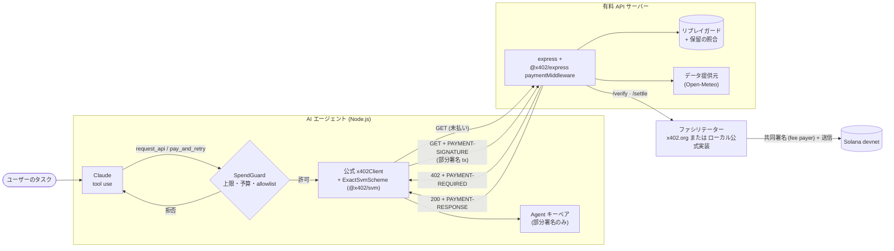
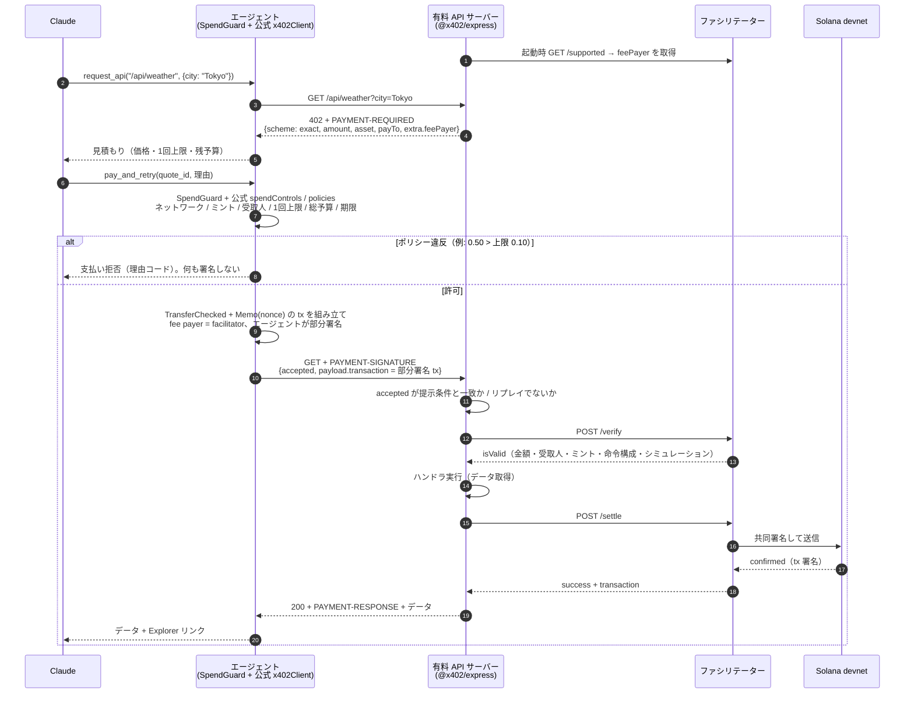
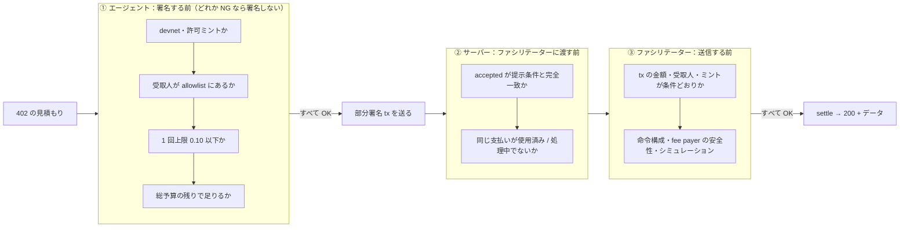

# solana-agent-pay

**AI エージェントが自分で API 利用料を払う** — 公式 x402（Solana `exact` スキーム）による Solana devnet 決済デモ

<p align="center">
  
</p>

> 画面はなく、ターミナルで動くデモです（有料 API サーバー ＋ AI エージェント）。`npm run demo` 1 コマンドで、エージェントが自分で支払う様子がログとして流れます。

Claude（tool use）で動くエージェントが有料 API を呼び、`HTTP 402 Payment Required` を受け取ると、価格が予算内かを判断します。払うと決めたら、**公式 x402 SDK**（`@x402/core` + `@x402/svm`）で SPL トークン送金トランザクションを組み立てて**部分署名**し、`PAYMENT-SIGNATURE` ヘッダに載せて再リクエストします。サーバーは**公式ミドルウェア**（`@x402/express`）で**ファシリテーター**に検証を依頼し、ハンドラ実行後にファシリテーターが fee payer として共同署名・送信（settle）してからデータを返します。

> ⚠️ **devnet 専用のデモです。** メインネットや実資金は一切使いません。決済トークン `dUSDC` は**このプロジェクトが devnet 上で独自に発行したテスト用 SPL トークン**（6 decimals）であり、Circle の devnet USDC ではありません。

- 1 コマンドで実行: `npm run demo`
- 実行ログ（実際の devnet トランザクション署名つき）: [`demo-output.txt`](./demo-output.txt)
- 公式 x402 との整合: **x402 v2 / `exact` / Solana devnet を公式パッケージそのもので実装**し、公式クライアント（`@x402/fetch`）からの支払いでも相互運用を確認済み（[詳細](#x402-との対応関係)）

## デモ結果（devnet, 2026-10-08 実行）

「東京と大阪の天気と空気の質を比べて、夕方の散歩に向いている方は？」というタスクで、エージェントは 4 回の 402 を受け取り、合計 0.06 dUSDC（総予算 0.30）を自分で支払ってデータを購入し、「大阪のほうが向いている」と回答しました。0.50 dUSDC のプレミアムレポート（1 回上限 0.10 超え）は購入を見送っています。さらに、**改造なしの公式クライアント**（`@x402/fetch` の `wrapFetchWithPayment`）でも同じサーバーに支払えました。安全チェック（上限超過・改ざん 402・リプレイ・金額違い・受取人違い）もすべて期待どおり拒否されました。サーバーの受取残高の増加（0.319999 → 0.389999 = +0.07）は、エージェントの台帳 0.06 と公式クライアントの支払い 0.01 の合計と一致しています。

<p align="center">
  
  <br><sub>実際の devnet 実行ログ <a href="./demo-output.txt"><code>demo-output.txt</code></a> の抜粋（⋮ は省略行、… は行末の省略）。<a href="docs/images/demo-terminal-animated.svg">アニメーション版</a></sub>
</p>

| 支払い | 金額 | クライアント | devnet トランザクション |
|---|---|---|---|
| `/api/weather?city=Tokyo` | 0.02 dUSDC | Claude エージェント | [2mjECGC2…Yto2vh](https://explorer.solana.com/tx/2mjECGC2GBpJkN4RQ8L1qDySs9xYxF8SgXeyoHQecggM812qd17LEmMk1fwVH37gFeNfNyDRufFnsBZ9ddYto2vh?cluster=devnet) |
| `/api/weather?city=Osaka` | 0.02 dUSDC | Claude エージェント | [4nN8teaL…Yuau69](https://explorer.solana.com/tx/4nN8teaLi2LdXHvVPJQyKAAaKwaNPMSkxD5QYzJezAPGDGsuEaYy62gyMm5kUSaZ49VWXiyMm3unwxFBYvYuau69?cluster=devnet) |
| `/api/air-quality?city=Tokyo` | 0.01 dUSDC | Claude エージェント | [n9VEzFPg…vy1eMd](https://explorer.solana.com/tx/n9VEzFPgJnfqutDE1tkXq4iE1wWUgcZQexbp88EiZ5QhkF6knqyujV46PZBRiTBBkoUpGrruMBpoSBCtqvy1eMd?cluster=devnet) |
| `/api/air-quality?city=Osaka` | 0.01 dUSDC | Claude エージェント | [fPRzZY2q…8PtFch](https://explorer.solana.com/tx/fPRzZY2q1LhizAjbxufafPTbG4LDypx2PU5F6QbyZYNMQKxj1uzRhne72Ag9AuvrWVLUoBAsgzvsfgBGY8PtFch?cluster=devnet) |
| `/api/air-quality?city=Kyoto` | 0.01 dUSDC | 公式 `@x402/fetch`（相互運用確認） | [4XXXk2S9…8DNDeM](https://explorer.solana.com/tx/4XXXk2S9KS26ufMWafwZWxTsGGvtvezMqf1iezu85tVnFdyP6uR3QWonEEeDZZ8fSNVEqjgDnZSYpfrcAm8DNDeM?cluster=devnet) |

各トランザクションは公式 `exact` スキームの形です: Compute Budget 2 命令 + SPL Token `TransferChecked`（受取人 ATA へ正確な金額）+ SPL Memo（公式クライアントが入れるランダム nonce）。**fee payer は公開ファシリテーター（`CKPKJWNd…qtWYp5`）**で、エージェントは送金の authority として署名するだけです（SOL 手数料 0）。テストトークンのミント: [78RhEqui…Z8JHeSq](https://explorer.solana.com/address/78RhEquiV9HyW32YNBpd48gz3bDwqNj5v5o3UZ8JHeSq?cluster=devnet)

<details>
<summary>📸 Solana Explorer で見た 1 件目の支払い（Tokyo weather, 0.02 dUSDC）</summary>
<br>
<p align="center">
  <a href="https://explorer.solana.com/tx/2mjECGC2GBpJkN4RQ8L1qDySs9xYxF8SgXeyoHQecggM812qd17LEmMk1fwVH37gFeNfNyDRufFnsBZ9ddYto2vh?cluster=devnet">
    
  </a>
  <br><sub>Status: Success（Finalized）、<b>Fee payer = ファシリテーター</b>（SOL −0.000010001）、エージェントは Signer のみ（SOL ±0）、トークン残高の増減（エージェント −0.02 / サーバー +0.02）、<code>Transfer (Checked)</code> 命令と Memo（nonce）。2026-10-08 にヘッドレス Chrome で取得したスクリーンショットを切り抜いたもの。</sub>
</p>
</details>

## 何ができるか

| | |
|---|---|
| 💳 **有料 API サーバー** | 公式 `@x402/express` の `paymentMiddleware`。未払いリクエストには `402` + `PAYMENT-REQUIRED`（`exact` / devnet / 金額 / ミント / 受取人 / `extra.feePayer`）。支払い付きリクエストはファシリテーターで verify → ハンドラ → settle の順に処理し、決済が通ったときだけ 200 を返す |
| 🧾 **ファシリテーター** | 既定は公開ファシリテーター `https://x402.org/facilitator`（登録不要）。`FACILITATOR=local` で公式実装（`@x402/core` + `@x402/svm`）をローカル起動し、使い捨て `funder` ウォレットを fee payer にすることも可能 |
| 🤖 **AI エージェント** | Claude が価格と残予算を見て「払う価値があるか」を判断。支払いは公式 `x402Client` + `ExactSvmScheme` が部分署名トランザクションを作る。全支払いを Solana Explorer リンクつきで記録 |
| 🛡️ **安全装置** | 1 回あたり上限・総予算上限・受取人 allowlist・ミント / ネットワーク制限（コード側で強制。LLM は上書き不可）＋公式 `spendControls` / `policies`、サーバー側のリプレイ防止、`settlement_pending` のオンチェーン照合 |
| 🧪 **テスト** | 偽ファシリテーターを使った HTTP レベルのテスト（正常・金額違い・受取人違い・リプレイ・条件改ざん・保留の回復）、ポリシーのテスト、devnet 実トランザクションでの統合テスト（公開 / ローカル / ローカル HTTP の 3 種のファシリテーター） |

## アーキテクチャ



### 決済フロー（有料 API 1 回分）



決済が `settlement_pending`（送信済みだが確定待ち）で返ってきた場合、公式サーバーは 1 回だけ再試行して 402 にします。送金が後から確定すると「払ったのにデータが届かない」ことになるため、このデモではサーバーの `onSettleFailure` フックで同じ署名済みトランザクションの settle を再要求しつつ、署名をオンチェーンで照合し、確定したらリクエストを回復させてデータを返します（同じバイト列の再送なので二重課金にはなりません）。実際の devnet 実行でも 2 回発生し、どちらも回復しました（`demo-output.txt` 86–87 行目など）。

### 安全チェックの全体像



| チェック | どこで | 守るもの | デモでの確認 |
|---|---|---|---|
| 1 回あたり上限（0.10 dUSDC） | エージェント（`SpendGuard` + 公式 `spendControls`） | 高額な請求 | 0.50 のプレミアムレポートを署名前に拒否 `per_call_cap_exceeded` |
| 総予算（0.30 dUSDC） | エージェント | 使いすぎ | 支払い中の分も予約として計上 |
| 受取人 allowlist | エージェント（`SpendGuard` + 公式 `policies`） | 改ざんされた 402 | `payTo` 差し替えを両方が拒否 `recipient_not_allowlisted` |
| devnet・許可ミントのみ | エージェント / サーバー | 誤ネットワーク・偽トークン | メインネット指定はテストで拒否 |
| リプレイ防止 | サーバー（リプレイガード）＋ファシリテーター | 同じ支払いの使い回し | 使用済み `PAYMENT-SIGNATURE` の再送を 402 `replayed_payment`。ファシリテーターに直接送っても `transaction_simulation_failed` で再決済されない |
| 金額の一致 | ファシリテーター（verify） | 不足払い | tx は 0.019999、申告は 0.02 → `invalid_exact_svm_payload_amount_mismatch` |
| 受取人の一致 | ファシリテーター（verify） | 別宛て送金 | tx は別ウォレット宛て、申告はサーバー宛て → `invalid_exact_svm_payload_recipient_mismatch` |
| 決済前にデータを渡さない | サーバー（公式ミドルウェア） | 未払い利用 | verify 失敗時はハンドラが実行されないことをテストで確認 |

## x402 との対応関係

**状態: 公式 x402 v2 の Solana `exact` スキームに準拠（公式パッケージで実装）。** 以前の独自フロー（クライアントが自分で送金し、署名を証明として送る `client-broadcast` 方式）は置き換えました。旧版はタグ [`v0.1.0-self-settled`](https://github.com/shoya-sue/solana-agent-pay/tree/v0.1.0-self-settled) に残しています。

| 項目 | このデモ |
|---|---|
| 使っている公式パッケージ | `@x402/core` / `@x402/svm` / `@x402/express` / `@x402/fetch`（いずれも 2.28.0） |
| プロトコル | x402 v2、`scheme: "exact"`、`network: "solana:EtWTRABZaYq6iMfeYKouRu166VU2xqa1"`（CAIP-2 の devnet） |
| ヘッダ | `PAYMENT-REQUIRED` / `PAYMENT-SIGNATURE` / `PAYMENT-RESPONSE`（エンコード・デコードは公式 SDK） |
| 送金方式 | クライアントが `TransferChecked` の**部分署名トランザクション**を作り、ファシリテーターが fee payer として共同署名・送信 |
| 決済タイミング | 既定の `authorization` フロー: verify → ハンドラ → settle → 200 |
| ファシリテーター | 公開 `https://x402.org/facilitator`（既定）／公式実装のローカル起動（`FACILITATOR=local`、`npm run facilitator`） |
| 相互運用の確認 | 改造なしの `@x402/fetch` `wrapFetchWithPayment` で支払い成功（デモのセクション 5、devnet テストでも 3 種のファシリテーターで確認） |
| 独自に足したもの | エージェント側の `SpendGuard`（総予算・予約）、Claude が見積もりを見てから払うための 2 段階 API（`get` → `payAndRetry`）、サーバー側のリプレイガードと `settlement_pending` の照合フック。いずれも公式 SDK のフック / 設定の範囲内 |

### 残っているギャップ（正直に）

- **テストトークンは公式の「既定アセット」ではない**: 公式クライアントの既定 `spendControls` は USDC などの既定アセットしか払わないため、他の x402 クライアントからこのサーバーに払うには `dUSDC` のミントを `allowedAssets` に追加する必要があります（デモ・テストでもそうしています）。Circle の devnet USDC を使えば設定なしで相互運用できますが、Circle フォーセットが必要なためこのデモでは自前ミントのままです。
- **公開ファシリテーターは無料の共有サービス**: SLA はなく、devnet の混雑時は `settlement_pending` が返ることがあります（上記の照合フックで回復）。止まっている場合は `FACILITATOR=local` に切り替えてください。
- **リプレイガードの保存先**: 単一プロセス向け（`data/settled-payments.json`）。複数インスタンスでは共有ストアが必要です。根本的な二重決済防止はファシリテーターと Solana の署名一意性が担います。
- **`@solana/web3.js` 1.x との併用**: ウォレット準備（ミント発行・ATA 作成）と残高確認は従来どおり web3.js、x402 の署名部分は公式パッケージが使う `@solana/kit` です。
- 公式のペイウォール UI（ブラウザ向け）や Bazaar（ディスカバリー拡張）は使っていません。

## セットアップ

必要なもの: Node.js 20.12 以上、Anthropic API キー。

```bash
git clone https://github.com/shoya-sue/solana-agent-pay.git
cd solana-agent-pay
npm install
cp .env.example .env   # ANTHROPIC_API_KEY を設定
```

### ファシリテーターの設定

| モード | 設定 | fee payer | 用途 |
|---|---|---|---|
| 公開（既定） | 何もしない（`FACILITATOR_URL=https://x402.org/facilitator`） | ファシリテーター側の鍵 | 登録不要。`/supported` に Solana devnet の `exact` がある |
| ローカル（同一プロセス） | `FACILITATOR=local` | `.wallets/funder.keypair.json`（使い捨て devnet 鍵） | 公開ファシリテーターが落ちているとき・オフライン（ローカルバリデータ）用 |
| ローカル（HTTP） | `npm run facilitator`（`:4022`）＋ `FACILITATOR_URL=http://localhost:4022` | 同上 | 公式 `HTTPFacilitatorClient` 経由で `/supported` `/verify` `/settle` を提供 |

ローカルモードは公式の `x402Facilitator` + `registerExactSvmScheme`（`@x402/core` / `@x402/svm`）そのもので、verify（命令構成・金額・受取人・fee payer の安全性・シミュレーション）と settle（共同署名・送信・確認）を行います。

## 実行方法

```bash
npm run demo
```

これだけで以下をすべて行い、色付きトランスクリプトを表示しつつ `demo-output.txt` に保存します。

1. 使い捨て devnet キーペアを `.wallets/` に生成（git 管理外）し、テスト用 SPL トークン `dUSDC` を発行してエージェントにミント
2. ファシリテーターの `/supported` を確認し、有料 API サーバーを起動（未払いリクエストの `PAYMENT-REQUIRED` を表示）
3. シナリオ A: 「東京と大阪の天気と空気の質を比べて、散歩に向いている方を教えて」→ エージェントが 4 回支払ってデータを購入
4. シナリオ B: 1 回上限（0.10）を超える 0.50 dUSDC のプレミアムレポート → エージェントが購入を見送る
5. 相互運用: 改造なしの公式 `@x402/fetch` クライアントで支払う
6. 安全チェック: 上限超過 / 改ざん 402（受取人差し替え）/ リプレイ / 金額違い / 受取人違い
7. 支払い一覧（Explorer リンク）と、エージェント・サーバーの残高変化（オンチェーンの増減と台帳の一致を確認）

ファシリテーターを公式実装のローカル版にする場合: `npm run demo:local-facilitator`（= `FACILITATOR=local npm run demo`）。

個別に動かす場合:

```bash
npm run setup                 # ウォレット生成・資金投入（冪等）
npm run server                # http://localhost:4021（FACILITATOR=local も可）
npm run agent -- "京都と福岡の天気を比べて"   # 別ターミナルで
npm run facilitator           # （任意）ローカルの公式ファシリテーター http://localhost:4022
```

### devnet SOL の入手について

必要な SOL はごくわずかです（ミントのレント + トークンアカウント 2 つで約 0.012 SOL）。送金手数料はファシリテーターが払うので、エージェントは SOL を使いません。`npm run setup` / `npm run demo` は `funder` ウォレットの残高が足りなければ devnet エアドロップを要求し（429 のときはバックオフ + 減額してリトライ）、レントは `funder` が負担します。`FACILITATOR=local` のときは `funder` が fee payer も兼ねます（1 件あたり約 0.00001 SOL）。

公開フォーセットは IP 単位の上限が厳しく、取れないことがあります。その場合は表示される `funder` アドレスに devnet SOL を 0.05 ほど送ってから再実行してください（[faucet.solana.com](https://faucet.solana.com) は GitHub ログインで上限が上がります。手元の devnet ウォレットからなら `solana transfer --url devnet <funder> 0.05`）。

ネットワークなしで試すなら、ローカルバリデータ + ローカルファシリテーターでも全フローを再現できます（公開ファシリテーターはローカルバリデータに届かないため自動で `FACILITATOR=local`。Explorer リンクはローカル RPC を指す `cluster=custom` になります）:

```bash
solana-test-validator --reset --quiet &   # Agave CLI
npm run demo:local                        # data/local/demo-output-local.txt に保存
```

### エンドポイント

| パス | 価格 | 内容 |
|---|---|---|
| `GET /catalog` | 無料 | エンドポイントと価格一覧 |
| `GET /api/weather?city=Tokyo` | 0.02 dUSDC | 現在の天気と今日の予報（Open-Meteo） |
| `GET /api/air-quality?city=Osaka` | 0.01 dUSDC | PM2.5 / PM10 / AQI |
| `GET /api/premium/forecast-report?city=Tokyo` | 0.50 dUSDC | 48 時間の時間別予報（わざと上限超え） |

### テスト

```bash
npm test             # ポリシー + HTTP テスト（偽ファシリテーター、ネットワーク不要、決定的）
npm run test:devnet  # devnet に実トランザクションを送る統合テスト（setup 済みが前提）
npm run typecheck
```

- HTTP テスト（`test/server.test.ts`）: 402 の内容（`feePayer` はファシリテーターの `/supported` から）/ 正常な支払い → 200 + `PAYMENT-RESPONSE` / リプレイ（ファシリテーターを呼ぶ前に拒否）/ 金額違い・受取人違い（verify で拒否、ハンドラは実行されない）/ `accepted` の改ざん（ファシリテーターを呼ばずに拒否）/ 安いエンドポイントの支払いで高いエンドポイントを開けない / `settlement_pending` の回復と、回復できないときは 402
- devnet テスト（`test/devnet.test.ts`）: 公開ファシリテーター・ローカル公式実装・ローカル HTTP の 3 種それぞれで、正常（オンチェーンの残高増と fee payer を確認）/ リプレイ / 金額違い / 受取人違い（残高が動かないこと）/ 公式 `@x402/fetch` クライアントからの支払い

## 安全性について

- **devnet 専用**: RPC URL に mainnet が含まれる場合や devnet 以外のジェネシスハッシュの場合は起動を拒否。エージェントも devnet の CAIP-2 以外には支払わない。
- **支出上限はコードで強制**: Claude は「払う」と要求できるだけで、可否は `SpendGuard` が決める（1 回上限 0.10 / 総予算 0.30 dUSDC、受取人 allowlist、許可ミント、見積もりの有効期限）。公式 `spendControls`（1 回上限）と `policies`（受取人 allowlist）も二重に設定。送信中の支払いも予約として予算に計上し、`settlement_pending` のときは「払われた可能性がある」として予約を解放しない。
- **402 を信用しない**: 402 応答の `payTo` を差し替えられても allowlist 外なら署名しない。
- **データは決済後**: 公式ミドルウェアは verify が通るまでハンドラを実行せず、settle が失敗したらレスポンスを返さない。ハンドラがエラーを返した場合は settle しない（課金されない）。
- **リプレイ防止**: ファシリテーターと Solana の署名一意性に加え、サーバー側でも支払いペイロードのハッシュを処理中 / 使用済みとして記録（`data/settled-payments.json`）。
- **秘密情報**: キーペアは `.wallets/`（パーミッション 600、`.gitignore` 済み）、API キーは `.env`（`.gitignore` 済み）。ログに秘密情報を出さない。

## 本番化するには

- **メインネットの注意点**: 本物の USDC（`EPjFWdd5AufqSSqeM2qN1xzybapC8G4wEGGkZwyTDt1v`）と実 SOL を扱うことになる。ネットワークを `solana:5eykt4UsFv8P8NJdTREpY1vzqKqZKvdp` に、RPC を商用プロバイダにし、既定アセットの USDC を使えば公式クライアントは追加設定なしで払える。
- **ファシリテーター**: 本番向けのファシリテーター（SLA・メインネット対応）を選ぶか、自前で運用するなら fee payer 鍵を KMS / HSM で保護し、残高監視・レート制限・優先手数料を整える。公式実装は fee payer が送金元にならないこと、命令レイアウト、Compute Budget の上限などを検証する。
- **鍵管理**: エージェントの鍵はファイルではなく KMS / HSM / MPC ウォレットやセッションキー（権限・上限付き）で管理。サーバーの受取アドレスはホットウォレットにしない（受け取り専用アドレス + 定期的なスイープ）。
- **ストア**: リプレイガードと保留中の決済の記録は Redis / Postgres などのユニーク制約つき永続ストアに置き、複数インスタンスで共有する。照合が時間内に終わらなかった支払いは非同期で追跡し、確定したらクレジット付与や返金を行う。
- **コンプライアンス**: 地域規制、KYT / 制裁リストのスクリーニング、会計処理（支払いログの保存）。
- **エージェント側の運用**: 予算の永続化（プロセス再起動でリセットされない）、支払い前の人間による承認しきい値、監査ログ、異常検知。

## 構成

```
src/
  config.ts              devnet 設定・ファシリテーター設定・Explorer リンク・devnet 強制
  server/
    app.ts               express + @x402/express paymentMiddleware、ルートと価格
    replay.ts            リプレイガード（x402ResourceServer のフック）
    reconcile.ts         settlement_pending のオンチェーン照合（onSettleFailure フック）
    facilitator.ts       公開 / ローカル ファシリテーターの選択
    data.ts              Open-Meteo からのデータ取得（失敗時はモックと明示）
  facilitator/
    local.ts             公式 x402Facilitator + registerExactSvmScheme（fee payer = funder）
    index.ts             npm run facilitator（/supported /verify /settle）
  agent/
    agent.ts             Claude tool-use ループ
    x402client.ts        公式 x402Client / x402HTTPClient のラッパー（見積もり → 支払い）、支払い台帳
    policy.ts            SpendGuard（上限・予算・allowlist）
  x402/                  @solana/kit の署名者読み込み、安全チェック用の不正ペイロード生成
  solana/                キーペア管理・devnet セットアップ・残高確認
  scripts/demo.ts        ワンコマンドデモ
test/                    vitest
```

## 使用技術

- TypeScript / Node.js 20、`tsx`、`vitest`、`express` 5
- 公式 x402: [`@x402/core`](https://www.npmjs.com/package/@x402/core) / [`@x402/svm`](https://www.npmjs.com/package/@x402/svm) / [`@x402/express`](https://www.npmjs.com/package/@x402/express) / [`@x402/fetch`](https://www.npmjs.com/package/@x402/fetch)（[x402-foundation/x402](https://github.com/x402-foundation/x402)）、[`@solana/kit`](https://github.com/anza-xyz/kit)
- [`@solana/web3.js`](https://github.com/solana-foundation/solana-web3.js) 1.x + [`@solana/spl-token`](https://github.com/solana-program/token) 0.4（ウォレット準備・残高確認）
- [`@anthropic-ai/sdk`](https://github.com/anthropics/anthropic-sdk-typescript)、モデル `claude-sonnet-5-5`（`CLAUDE_MODEL` で変更可）
- 天気・大気質データ: [Open-Meteo](https://open-meteo.com/)（API キー不要）

---

## English

**solana-agent-pay** is a demo of an AI agent that pays for API calls by itself on **Solana devnet**, using the **official x402 protocol** (v2, `exact` scheme on Solana): `HTTP 402 Payment Required` → partially-signed transfer → a **facilitator** verifies, co-signs as fee payer and settles → `200` + data.

> There is no GUI: it is a terminal demo (a paid API server + an AI agent). See the overview image at the top, and this excerpt of a real devnet run:

<p align="center">
  
  <br><sub>Excerpt of <a href="./demo-output.txt"><code>demo-output.txt</code></a> (⋮ = lines omitted, … = truncated). <a href="docs/images/demo-terminal-animated.svg">Animated version</a> · <a href="docs/images/explorer-tx.png">Explorer screenshot of the first payment</a></sub>
</p>

- **Official packages, no custom protocol code**: the server uses `@x402/express` `paymentMiddleware` with `@x402/svm`'s `ExactSvmScheme`; the agent uses `@x402/core`'s `x402Client` / `x402HTTPClient` with `@x402/svm`'s client scheme (all 2.28.0). Headers are `PAYMENT-REQUIRED` / `PAYMENT-SIGNATURE` / `PAYMENT-RESPONSE`, network `solana:EtWTRABZaYq6iMfeYKouRu166VU2xqa1` (devnet).
- **Facilitator settlement**: by default the public facilitator `https://x402.org/facilitator` (no signup; lists Solana devnet `exact` in `/supported`). `FACILITATOR=local` runs the official facilitator implementation (`x402Facilitator` + `registerExactSvmScheme`) in-process with the throwaway `funder` wallet as fee payer; `npm run facilitator` exposes it over HTTP (`/supported`, `/verify`, `/settle`) on `:4022`. The agent never pays SOL fees.
- **Interop verified**: an unmodified `@x402/fetch` `wrapFetchWithPayment` client pays the server in the demo (section 5) and in the devnet tests against all three facilitator setups.
- A **Claude tool-use agent** (`claude-sonnet-5-5`) sees the price and its remaining budget, decides whether the purchase is worth it, pays, and logs every payment with a Solana Explorer (devnet) link.
- **Safety**: per-call cap and total budget enforced in code (`SpendGuard`, the LLM cannot override them) plus the official `spendControls` and a payTo-allowlist `policies` filter; mint/network restrictions; server-side replay guard on top of the facilitator; data is served only after verify, and the response only after settle. Rejected in the demo: over-cap price, tampered `payTo`, replayed `PAYMENT-SIGNATURE` (also rejected by the facilitator directly), a tx that pays 0.019999 while claiming 0.02 (`invalid_exact_svm_payload_amount_mismatch`), and a tx that pays another wallet (`invalid_exact_svm_payload_recipient_mismatch`).
- **`settlement_pending` handling**: under devnet load the facilitator may report a sent-but-unconfirmed settlement. The official server retries once and then answers 402, which could charge the client without delivering data. An `onSettleFailure` hook re-requests settlement of the same signed bytes and checks the signature on-chain, recovering the request once confirmed (no double charge possible). It happened twice in the recorded run and both recovered.
- **Token**: `dUSDC` is a **test SPL token minted by this project on devnet** (6 decimals), not Circle's devnet USDC.
- **Previous version**: the earlier self-settled flow (client broadcasts the transfer itself and sends the signature) was replaced; it is preserved at tag [`v0.1.0-self-settled`](https://github.com/shoya-sue/solana-agent-pay/tree/v0.1.0-self-settled).
- **Remaining gaps**: `dUSDC` is not an official default asset, so third-party x402 clients must allow-list the mint in `spendControls.allowedAssets` (Circle devnet USDC would avoid this); the public facilitator is a free shared service without an SLA; the replay guard store is single-process; wallet setup still uses `@solana/web3.js` 1.x alongside `@solana/kit`; no paywall UI / Bazaar discovery.

**Demo result (devnet, 2026-10-08):** the agent handled four 402s and paid 0.06 dUSDC in total (e.g. [Tokyo weather](https://explorer.solana.com/tx/2mjECGC2GBpJkN4RQ8L1qDySs9xYxF8SgXeyoHQecggM812qd17LEmMk1fwVH37gFeNfNyDRufFnsBZ9ddYto2vh?cluster=devnet), [Osaka weather](https://explorer.solana.com/tx/4nN8teaLi2LdXHvVPJQyKAAaKwaNPMSkxD5QYzJezAPGDGsuEaYy62gyMm5kUSaZ49VWXiyMm3unwxFBYvYuau69?cluster=devnet)), declined a 0.50 report above its 0.10 per-call cap, an off-the-shelf `@x402/fetch` client paid 0.01 ([Kyoto air quality](https://explorer.solana.com/tx/4XXXk2S9KS26ufMWafwZWxTsGGvtvezMqf1iezu85tVnFdyP6uR3QWonEEeDZZ8fSNVEqjgDnZSYpfrcAm8DNDeM?cluster=devnet)), and all safety checks passed. Every transaction's fee payer is the facilitator. The server's on-chain balance grew by exactly 0.07 = agent ledger + interop payment. Full transcript: [`demo-output.txt`](./demo-output.txt).

```bash
npm install
cp .env.example .env      # set ANTHROPIC_API_KEY
npm run demo              # wallets → server + facilitator → agent → interop → safety checks → transcript (demo-output.txt)
FACILITATOR=local npm run demo   # same, with the official facilitator running locally (fee payer = throwaway funder wallet)
npm test                  # policy + HTTP tests (fake facilitator, offline)
npm run test:devnet       # live devnet tests: public, local and local-HTTP facilitators + @x402/fetch interop
```

## License

MIT © shoya-sue
